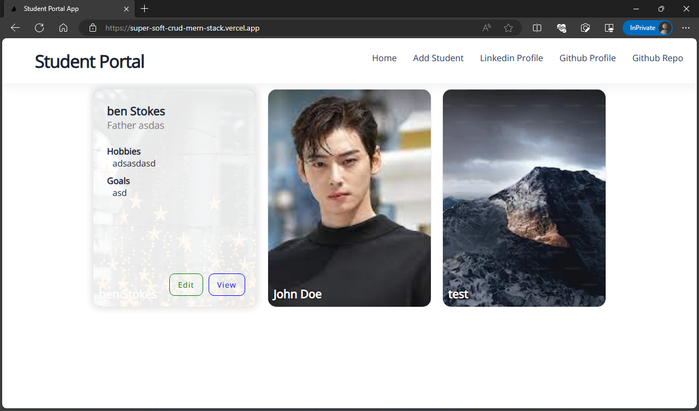
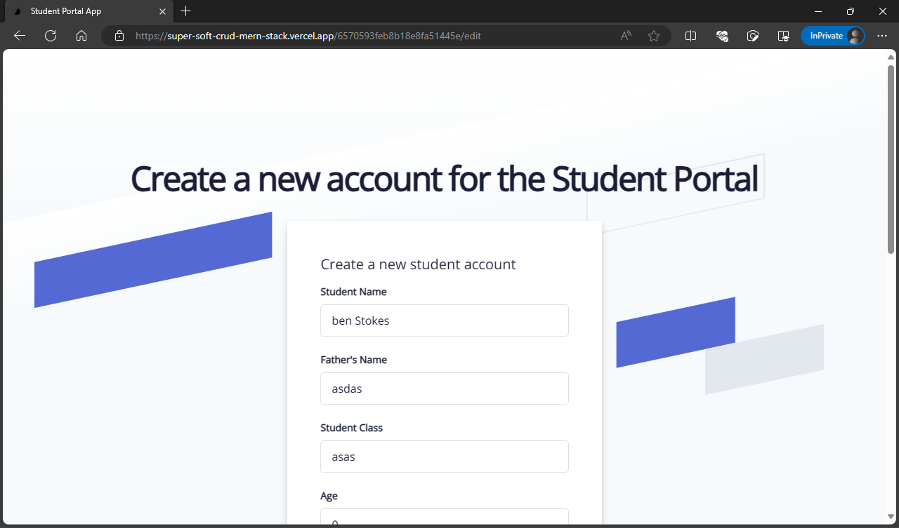
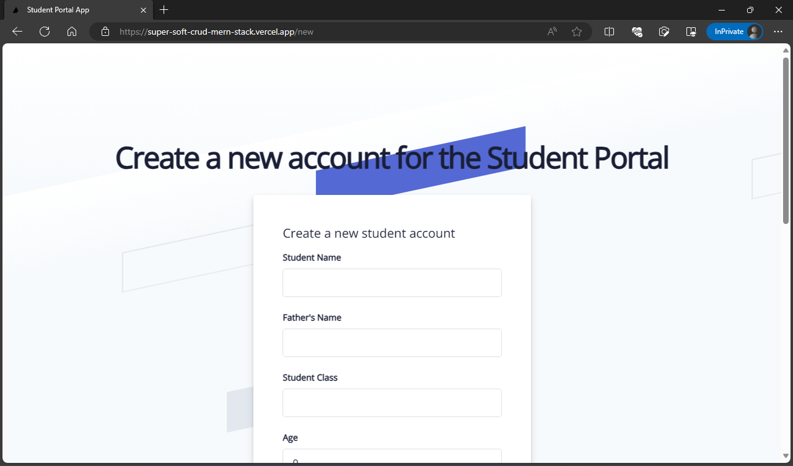

# CRUD Operation using MERN Stack

This project is a demonstration of how to make a CRUD (Create, Read, Update, Delete) operation using the MERN stack, which consists of MongoDB, Express, React, and Node.js. It also uses Mongoose, SWR, and TypeScript as additional technologies.

## Screenshots

## Technologies used

- **MongoDB**: A document-based database that stores data in JSON-like format and allows for flexible and scalable data modeling.
- **Mongoose**: An object data modeling (ODM) library that provides a schema-based solution to model data and interact with MongoDB.
- **Express**: A web framework that handles the backend logic and provides middleware and routing for the application.
- **React**: A library that builds user interfaces using components and manages the state and props of the application.
- **Node.js**: A runtime environment that executes JavaScript code outside the browser and enables the use of npm packages and modules.
- **SWR**: A library that handles data fetching and caching for the application and provides features such as revalidation, error handling, and suspense.
- **TypeScript**: A superset of JavaScript that adds static type definitions and enhances the code quality and readability.

## Features

- **CRUD operation**: The project allows the user to perform CRUD operations on users from a MongoDB database. The user can create, read, update, and delete users using the form and the table in the application.
- **Mongoose schema and model**: The project uses a Mongoose schema and model to define the structure and validation of the user data. The schema specifies the fields, types, and constraints of the user document, while the model provides methods to query and manipulate the data.
- **Express API**: The project uses an Express API to handle the requests and responses between the frontend and the backend. The API defines the endpoints and the logic for each CRUD operation and uses Mongoose to interact with the database.
- **React components**: The project uses React components to render the user interface and handle the user interactions. The components use SWR to fetch and cache the data from the API and display the loading and error states. The components also use TypeScript to define the types and props of the data and the components.
- **Vercel deployment**: The project is deployed on Vercel, a platform that allows for easy hosting and deployment of web applications.

## Installation and usage

To run this project, you need to have Node.js, npm, and MongoDB installed on your machine. Then, follow these steps:

1. Clone this repository using `git clone https://github.com/muhammad-shumail/super-soft-crud-mern-stack.git`
2. Navigate to the project directory using `cd super-soft-crud-mern-stack`
3. Install the dependencies using `npm install`
4. Create a `.env` file in the root directory and add the following variables:
  - `MONGODB_URI`: The connection string to your MongoDB database
  - `PORT`: The port number for your Express server
5. Start the development server using `npm run dev`
6. Open your browser and go to `http://localhost:3000` to see the project

To see the deployed version of the project, go to `https://super-soft-crud-mern-stack.vercel.app/`

## Author

This project was created by [Muhammad Shumail Ansari](https://github.com/muhammad-shumail), a software engineer and web developer. You can find his GitHub profile [here](https://github.com/muhammad-shumail) and his LinkedIn profile [here](https://www.linkedin.com/in/muhammad-shumail-ansari/).